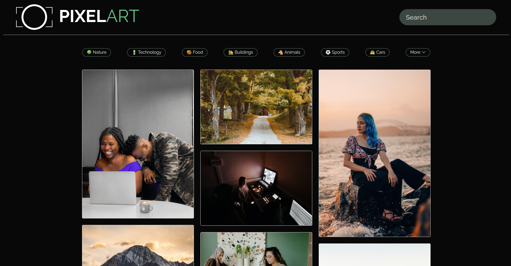

# Pixelart
#### Photo Gallery Built With HTML, CSS, JS and Unsplash API, SEPT 19 2022 
#### By **Dennis Kiboi** 

## Description 
This is photo gallery website, built using HTML, CSS and Vanilla JavaScript, where users can view photos and search different categories.



## How to Use
### Requirements
* A computer, tablet or phone
* Access to the internet

### View Live Site 
Ensure that your device of choice has a browser installed.
Click the link provided below to view the site.

https://dennis-kiboi.github.io/pixelart/

### Using the App
The user can navigate the web app easily and be able to:
* View different photos that interest them
* Click on a single photo to expand it and also view the details of the photo
* Search different categories of photos


## Run Locally
### Setup/Installation Requirements
To run this app locally, you need a PC with the following:
* Access to the internet

### Installation Process
1. Clone this repository using

    ```bash
      git clone git@github.com:mururi/pixelart.git
    ```
    or by downloading a ZIP file of the code.
  
2. The repository, if downloaded as a .zip file will need to be extracted to your preferred location and opened

3. Open the index.html file in your preferred browser.

## Technologies Used
* HTML
* CSS
* JS
* Masonry JS

## Support and Contact Details
Incase of any query, need for collaboration or issues with this code, feel free to reach me at
dennis.kiboi@moringaschool.com

## License 
MIT License

Copyright &copy; 2022 Dennis Kiboi

Permission is hereby granted, free of charge, to any person obtaining a copy of this software and associated documentation files (the "Software"), to deal in the Software without restriction, including without limitation the rights to use, copy, modify, merge, publish, distribute, sublicense, and/or sell copies of the Software, and to permit persons to whom the Software is furnished to do so, subject to the following conditions:

The above copyright notice and this permission notice shall be included in all copies or substantial portions of the Software.

THE SOFTWARE IS PROVIDED "AS IS", WITHOUT WARRANTY OF ANY KIND, EXPRESS OR IMPLIED, INCLUDING BUT NOT LIMITED TO THE WARRANTIES OF MERCHANTABILITY, FITNESS FOR A PARTICULAR PURPOSE AND NONINFRINGEMENT. IN NO EVENT SHALL THE AUTHORS OR COPYRIGHT HOLDERS BE LIABLE FOR ANY CLAIM, DAMAGES OR OTHER LIABILITY, WHETHER IN AN ACTION OF CONTRACT, TORT OR OTHERWISE, ARISING FROM, OUT OF OR IN CONNECTION WITH THE SOFTWARE OR THE USE OR OTHER DEALINGS IN THE SOFTWARE.